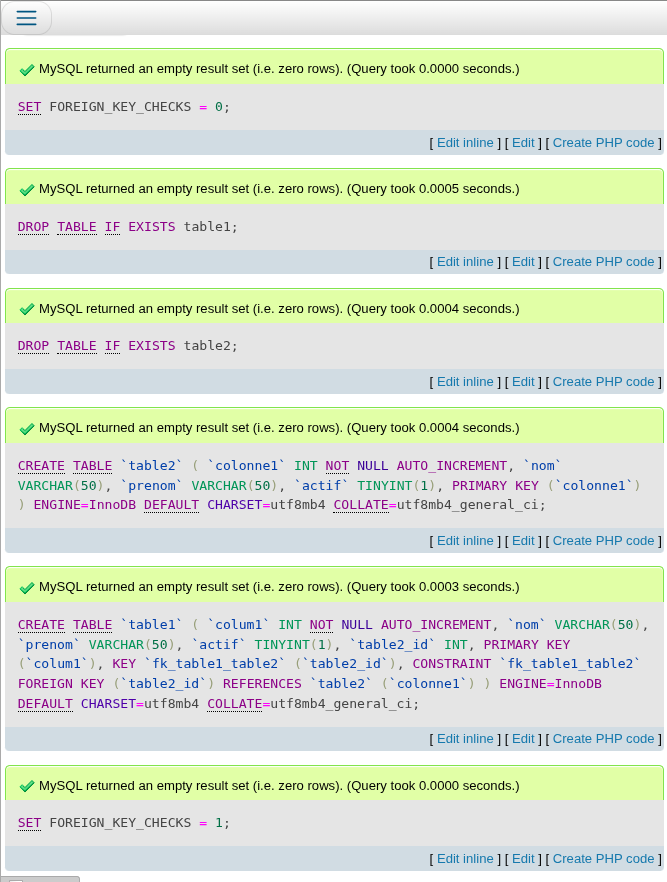

- Créer 2 tables, avec 4 colonnes chacunes :
- 1 relation de la table A vers la table B : 
- 1 colonne devra être un boolean randomisé vrai/faux :
- 2 colonnes noms / prénoms ( je select from pour vérifier le resultat) :
## MYSQL :

## Etape 3

- Insérer 5 millions de lignes pour chaque table (randomisées en terme de contenu) : 17,594 sec + 27,863 sec![[Pasted image 20251029142728.png]] ![[Pasted image 20251029142854.png]]
- Requêter toutes les lignes 0,275 sec![[Pasted image 20251029143059.png]] ![[Pasted image 20251029143118.png]]![[Pasted image 20251029143310.png]]![[Pasted image 20251029143315.png]]
 
- Requêter tous les boolean true : 2.432 sec![[Pasted image 20251029143451.png]]![[Pasted image 20251029143456.png]]![[Pasted image 20251029143519.png]]![[Pasted image 20251029143521.png]]
- Requêter tous les boolean false  : 1.839 sec![[Pasted image 20251029143905.png]]![[Pasted image 20251029143908.png]]![[Pasted image 20251029144016.png]]![[Pasted image 20251029144020.png]]
- Requeter toutes les lignes en ordonnant par ordre alphabetique DESC sur le nom : 2.024 sec![[Pasted image 20251029144137.png]]![[Pasted image 20251029144140.png]]![[Pasted image 20251029144143.png]]![[Pasted image 20251029144145.png]]
- Requeter toutes les lignes en ordonnant par ordre alphabetique ASC sur le nom : 2.122 sec![[Pasted image 20251029144247.png]]![[Pasted image 20251029144249.png]]![[Pasted image 20251029144251.png]]![[Pasted image 20251029144254.png]]
- Requeter toutes les lignes avec les jointures :  14.838sec![[Pasted image 20251029144610.png]]![[Pasted image 20251029144616.png]]

## Etape 4

- Faire un update sur toutes les lignes pour changer le boolean à false : 17,3659 sec![[Pasted image 20251029144756.png]]![[Pasted image 20251029144801.png]]
- Faire un update sur toutes les lignes pour changer la FK en faisant un "+1" à chaque fois, et si c'est à 5000000 on la repasse à 1. : 38,157 sec![[Pasted image 20251029145049.png]]

## Etape 5

- Créer des index sur les colonnes `nom` et `boolean` des deux tables. : 12,563 sec
- Recommencer les mêmes requetes et noter les nouveaux temps
	- Requêter toutes les lignes 0.153 sec
	- Requêter tous les boolean true : 0
	- Requêter tous les boolean false  : 1,017 sec
	- Requeter toutes les lignes en ordonnant par ordre alphabetique DESC sur le nom : 0.52 sec
	- Requeter toutes les lignes en ordonnant par ordre alphabetique ASC sur le nom : 0.63 sec
	- Requeter toutes les lignes avec les jointures : Total query runtime: 50 msec

## POSTGRE

- Créer 2 tables, avec 4 colonnes chacunes : 37 msec![[Pasted image 20251029141537.png]]
- 1 relation de la table A vers la table B :  37msec
- 1 colonne devra être un boolean randomisé vrai/faux : 4msec.
- 2 colonnes noms / prénoms ( je select from pour vérifier le resultat) : 2msec

## Etape 3

- Insérer 5 millions de lignes pour chaque table (randomisées en terme de contenu) = Inserted row id: 7 secs 828 msec![[Pasted image 20251029141607.png]]
- Requêter toutes les lignes Total query runtime: 1 secs 444 msec. ![[Pasted image 20251029141715.png]]
- Requêter tous les boolean true : Total query runtime: 800 msec![[Pasted image 20251029141740.png]]
- Requêter tous les boolean false  : Total query runtime: 737 msec![[Pasted image 20251029141753.png]]
- Requeter toutes les lignes en ordonnant par ordre alphabetique DESC sur le nom : Total query runtime: 5 secs 609 msec![[Pasted image 20251029141802.png]]
- Requeter toutes les lignes en ordonnant par ordre alphabetique ASC sur le nom : Total query runtime: 3 secs 219 msec![[Pasted image 20251029141825.png]]
- Requeter toutes les lignes avec les jointures : Total query runtime: 5 secs 927 msec![[Pasted image 20251029141858.png]]

## Etape 4

- Faire un update sur toutes les lignes pour changer le boolean à false Query took ![[Pasted image 20251029142105.png]]
- Faire un update sur toutes les lignes pour changer la FK en faisant un "+1" à chaque fois, et si c'est à 5000000 on la repasse à 1. successfully in 33 msec![[Pasted image 20251029142124.png]]
 
## Etape 5

- Créer des index sur les colonnes `nom` et `boolean` des deux tables. : 4 secs 70 msec![[Pasted image 20251029142135.png]]
- Recommencer les mêmes requetes et noter les nouveaux temps
	- Requêter toutes les lignes Total query runtime: 1 secs 226 msec![[Pasted image 20251029142144.png]]
	- Requêter tous les boolean true : 0
	- Requêter tous les boolean false  : 1 secs 519 msec![[Pasted image 20251029142156.png]]
	- Requeter toutes les lignes en ordonnant par ordre alphabetique DESC sur le nom : Total query runtime: 1 secs 518 msec![[Pasted image 20251029142210.png]]
	- Requeter toutes les lignes en ordonnant par ordre alphabetique ASC sur le nom : Total query runtime: 1 secs 493 msec![[Pasted image 20251029142220.png]]
	- Requeter toutes les lignes avec les jointures : 5 secs 927 msec![[Pasted image 20251029142237.png]]

## SQLITE
## Etape 3

- Insérer 5 millions de lignes pour chaque table (randomisées en terme de contenu) = Inserted row id: 38 sec![[Pasted image 20251029152009.png]]
- Requêter toutes les lignes Total query runtime: 16 sec ![[Pasted image 20251029152049.png]]
- Requêter tous les boolean true : 8,659 sec![[Pasted image 20251029152137.png]]
- Requêter tous les boolean false  : 8,652 sec![[Pasted image 20251029152159.png]]
- Requeter toutes les lignes en ordonnant par ordre alphabetique DESC sur le nom : Total query runtime: 18,651 sec![[Pasted image 20251029152251.png]]
- Requeter toutes les lignes en ordonnant par ordre alphabetique ASC sur le nom : Total query runtime: 18,762 sec![[Pasted image 20251029152347.png]]
- Requeter toutes les lignes avec les jointures : Total query runtime: 4,684 sec![[Pasted image 20251029152524.png]]

## Etape 4

- Faire un update sur toutes les lignes pour changer le boolean à false Query took 1 : 10.990sec![[Pasted image 20251029153109.png]]
- Faire un update sur toutes les lignes pour changer la FK en faisant un "+1" à chaque fois, et si c'est à 5000000 on la repasse à 1. : 4.252 sec ![[Pasted image 20251029153137.png]] 
## Etape 5

- Créer des index sur les colonnes `nom` et `boolean` des deux tables. : 4.256sec![[Pasted image 20251029152635.png]]
- Recommencer les mêmes requetes et noter les nouveaux temps
	- Requêter toutes les lignes Total query runtime: 16.928sec![[Pasted image 20251029152724.png]]
	- Requêter tous les boolean true : ![[Pasted image 20251029152802.png]]
	- Requêter tous les boolean false  :8.534 ![[Pasted image 20251029152832.png]]
	- Requeter toutes les lignes en ordonnant par ordre alphabetique DESC sur le nom : Total query runtime: 19.126 sec ![[Pasted image 20251029152916.png]]
	- Requeter toutes les lignes en ordonnant par ordre alphabetique ASC sur le nom : Total query runtime:17.146 sec ![[Pasted image 20251029152947.png]]
	- Requeter toutes les lignes avec les jointures : 12.245 sec

## Etape 6 
SQLITE ->  Pratique pour des petits projet avec une initialisation rapide et sans configuration, Rivalise avec mysql sur des requetes local mais n'a pas l'aire adapter au grosse bdd. Donc pertinent sur des petits projet ou des testes de requetes mais personnelement, je ne l'utiliserais pas pour des projets avec pas mal de traitement en bdd.

MYSQL -> Pour moi, Elle est intermédiaire. simpliciter a utiliser grace a phpmyadmin. BDD utile pour les projet moyen avec bonne possibiliter de maintenance. Deplus il est archi documenter. je l'utiliserais pour les intégration moyenne et projet perso si je veux pas trop me prendre la tête.

PostgreSQL -> Perso, un coup de coeur, je l'utilise de plus en plus notament en entreprise avec marco et j'ai bien plus l'impression de faire une vrai bonne bdd. Bien plus poussé en tout que ce soit en performance ou la view que nous offre pgadmin. Très robuste et large possibiliter de requetes complexes en peut de temps. Malgré qu'il soit plus lourd a configurer et dure a comprendre quand on connais pas, je le conseil a tout le monde.
